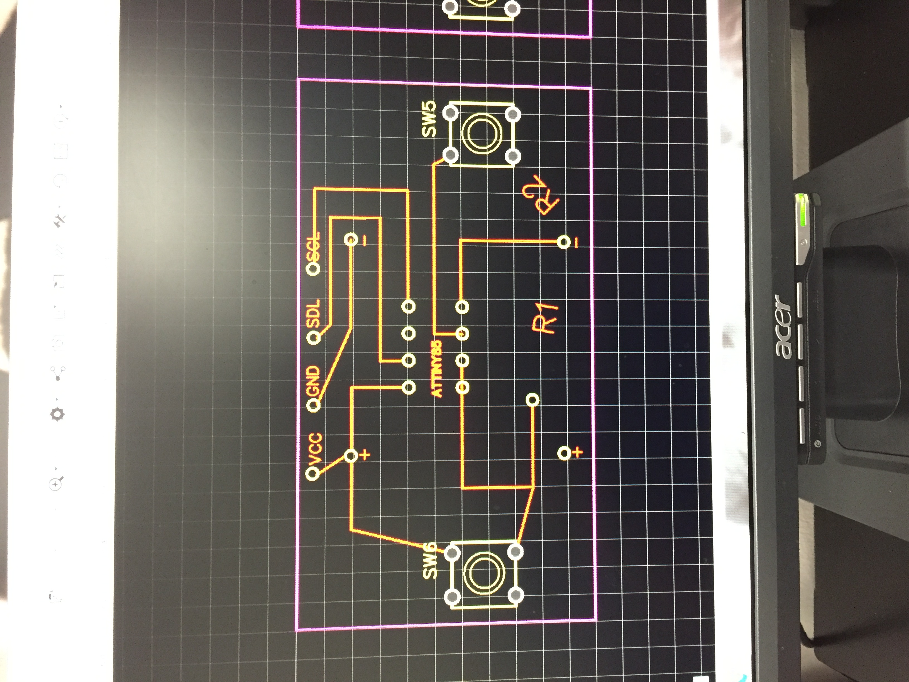
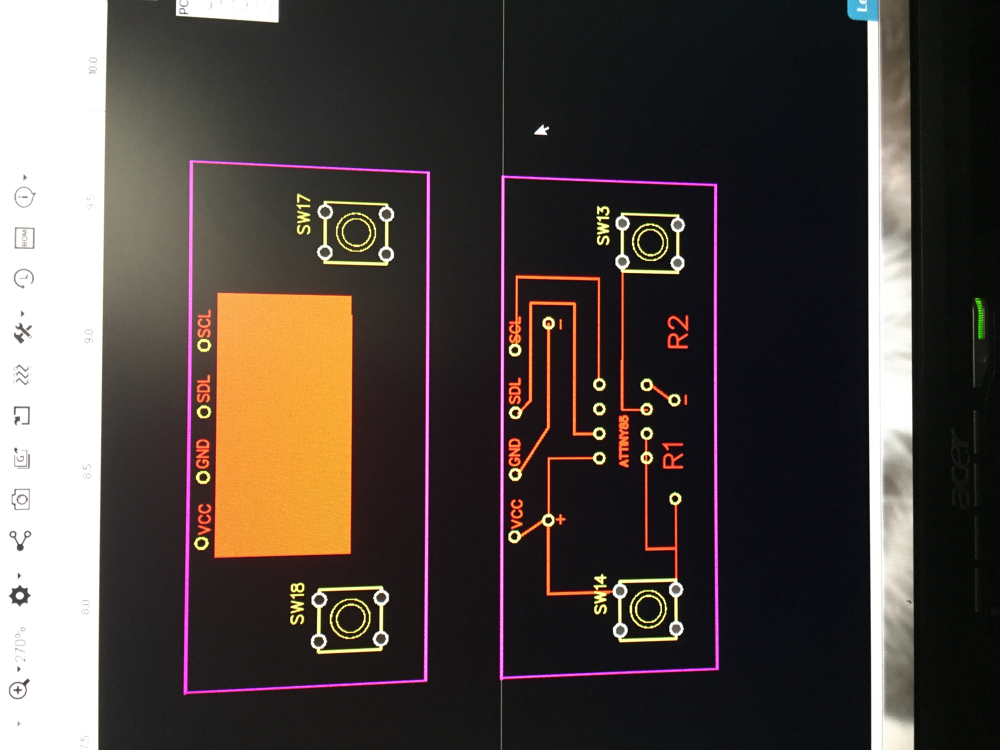
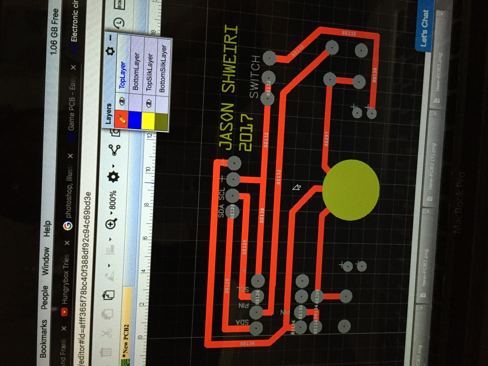
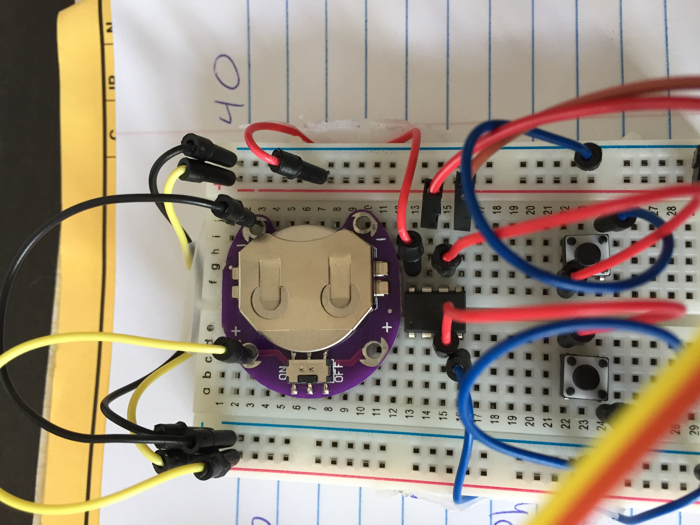
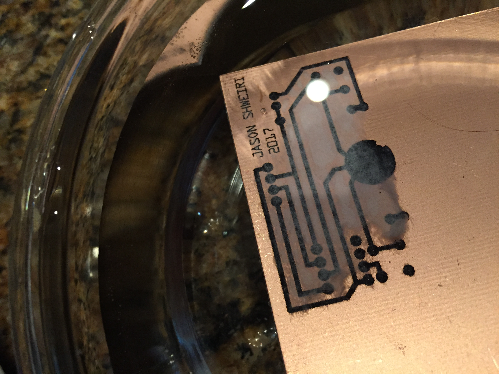
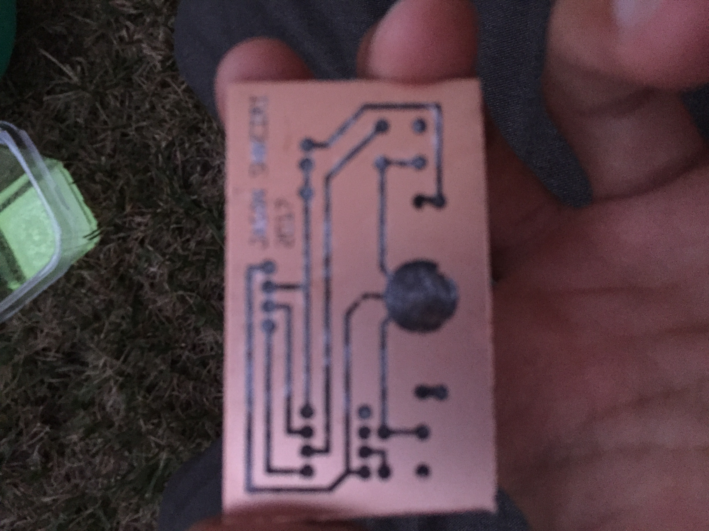
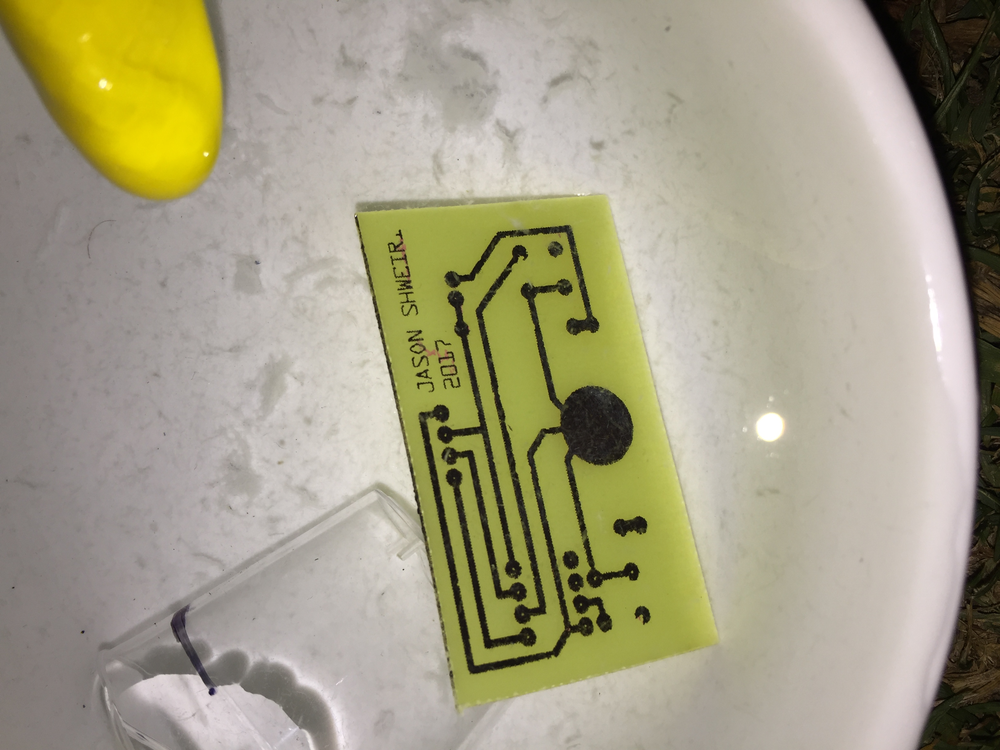

# ATtiny85-Game-Console

This is a project I made in 2017, it consisted of 2 tactile push buttons, an 0.96" OLED screen, a CR2032 button cell battery, and a slot for inserting a microcontroller. The microcontroller I used was an ATtint85 and the 2 games i created were snake and brick breaker. The first iteration of the project was done on a breadboard, then on a pcb that I designed, etched, and cut myself. After verifying the PCB worked I ordered professionally made PCBs from China

<figure class="video_container">
  <video controls="true" allowfullscreen="true" width="320" height="240">
    <source src="resources/IMG_6003.MOV">
  </video>
</figure>

<figure class="video_container">
  <video controls="true" allowfullscreen="true" width="320" height="240">
    <source src="resources/IMG_6624.MOV.mp4">
  </video>
</figure>

<figure class="video_container">
  <video controls="true" allowfullscreen="true" width="320" height="240">
    <source src="resources/IMG_6872.MOV.mp4">
  </video>
</figure>
